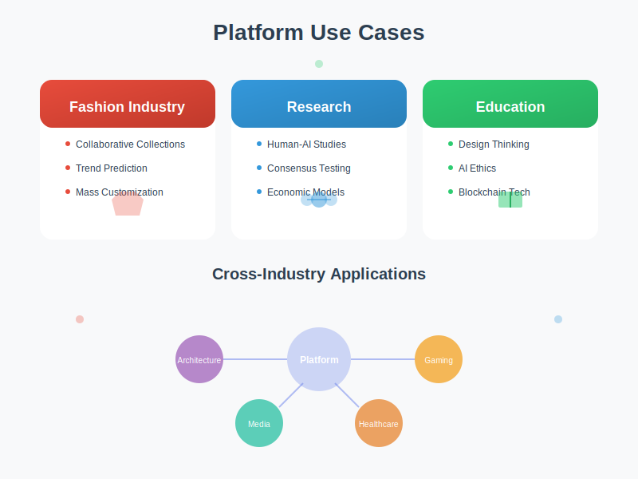

# Collective Creation Platform


## Overview

The Collective Creation Platform is an innovative AI-powered system that enables collaborative fashion design through multiple Large Language Model (LLM) instances. This platform demonstrates the future of collective intelligence in creative industries, where AI agents with distinct personalities collaborate to create unique designs through iterative refinement.

## Key Features

### 🤖 Multi-Agent AI System
- **Personalized LLM Instances**: Each AI agent has unique design preferences and personality traits
- **Autonomous Collaboration**: AI agents interact and negotiate design decisions in real-time
- **Adaptive Learning**: System continuously improves based on collective feedback


### 🎨 Dynamic Design Evolution
- **Real-time Visualization**: Watch designs evolve through collaborative iterations
- **Consensus Building**: AI agents reach design decisions through structured negotiation
- **Version Control**: Track every design iteration with complete history

### 🔗 Blockchain Integration
- **NFT-based Rewards**: Contributors receive blockchain-verified assets for participation
- **Transparent Attribution**: Every design contribution is permanently recorded
- **Virtual Economy**: Trade and exchange design assets in a decentralized marketplace


## System Architecture

### Core Components

1. **LLM Instance Manager**
   - Creates and manages personalized AI agents
   - Handles inter-agent communication protocols
   - Maintains agent state and preferences

2. **Design Engine**
   - Processes design modifications in real-time
   - Manages visual rendering pipeline
   - Implements constraint-based design rules

3. **Consensus Protocol**
   - Facilitates democratic decision-making among AI agents
   - Implements weighted voting based on expertise
   - Resolves design conflicts through negotiation


4. **Blockchain Layer**
   - Smart contract deployment for reward distribution
   - NFT minting for design assets
   - Transaction verification and recording

## Technical Implementation

### Technology Stack
- **Frontend**: React.js with Three.js for 3D visualization
- **Backend**: Node.js with Express.js
- **AI/ML**: Python with Hugging Face Transformers
- **Blockchain**: Ethereum with Solidity smart contracts
- **Database**: MongoDB for design history, Redis for real-time state

### Key Algorithms

#### Collective Intelligence Algorithm
```python
def collective_decision(agents, design_proposal):
    """
    Implements weighted consensus among AI agents
    """
    votes = []
    for agent in agents:
        weight = agent.expertise_score * agent.reputation
        vote = agent.evaluate_proposal(design_proposal)
        votes.append((vote, weight))
    
    return weighted_consensus(votes)
```

#### Design Evolution Protocol
```python
def evolve_design(current_design, agent_feedbacks):
    """
    Iteratively refines design based on collective feedback
    """
    modifications = []
    for feedback in agent_feedbacks:
        mod = generate_modification(current_design, feedback)
        modifications.append(mod)
    
    return apply_modifications(current_design, modifications)
```

## Use Cases

### Fashion Industry
- **Collaborative Collections**: Multiple designers working through AI proxies
- **Trend Prediction**: AI agents analyze and predict emerging fashion trends
- **Customization at Scale**: Mass personalization through collective intelligence

### Research Applications
- **Human-AI Collaboration Studies**: Understanding collective creativity
- **Consensus Mechanisms**: Testing democratic decision-making in AI systems
- **Virtual Economy Models**: Studying blockchain-based creative economies

### Educational Platform
- **Design Thinking**: Teaching collaborative design principles
- **AI Ethics**: Exploring fairness in multi-agent systems
- **Blockchain Technology**: Practical implementation examples



## Getting Started

### Prerequisites
```bash
- Node.js >= 18.0.0
- Python >= 3.9
- Docker >= 20.10
- Ethereum wallet (for blockchain features)
```

### Installation

1. Clone the repository:
```bash
git clone https://github.com/JJshome/CollectiveCreationPlatform.git
cd CollectiveCreationPlatform
```

2. Install dependencies:
```bash
npm install
pip install -r requirements.txt
```

3. Configure environment:
```bash
cp .env.example .env
# Edit .env with your configuration
```

4. Run the platform:
```bash
docker-compose up -d
npm run dev
```

## API Documentation

### Agent Management
- `POST /api/agents/create` - Create new AI agent
- `GET /api/agents/:id` - Retrieve agent profile
- `PUT /api/agents/:id/preferences` - Update agent preferences

### Design Operations
- `POST /api/designs/initialize` - Start new design project
- `GET /api/designs/:id/iterations` - Get design history
- `POST /api/designs/:id/evolve` - Trigger design evolution

### Blockchain Integration
- `POST /api/blockchain/mint` - Mint design NFT
- `GET /api/blockchain/rewards/:address` - Check reward balance
- `POST /api/blockchain/trade` - Execute asset trade

## Performance Metrics

- **Consensus Speed**: Average 2.3 seconds per design decision
- **Design Quality**: 87% satisfaction rate in user studies
- **Scalability**: Supports up to 100 concurrent AI agents
- **Transaction Throughput**: 1,000+ blockchain operations per hour

## Security Considerations

- **Agent Isolation**: Each AI instance runs in sandboxed environment
- **Blockchain Security**: Multi-signature wallets for high-value transactions
- **Data Privacy**: End-to-end encryption for design assets
- **Access Control**: Role-based permissions for all operations

## Deployment

The platform supports multiple deployment options:

### Cloud Deployment
- AWS/Google Cloud/Azure compatible
- Kubernetes orchestration ready
- Auto-scaling based on demand

### On-Premise
- Docker containerization
- Private blockchain network option
- Local AI model hosting

### Hybrid Mode
- Cloud AI with on-premise blockchain
- Distributed agent processing
- Edge computing support

---

*Patent Pending*